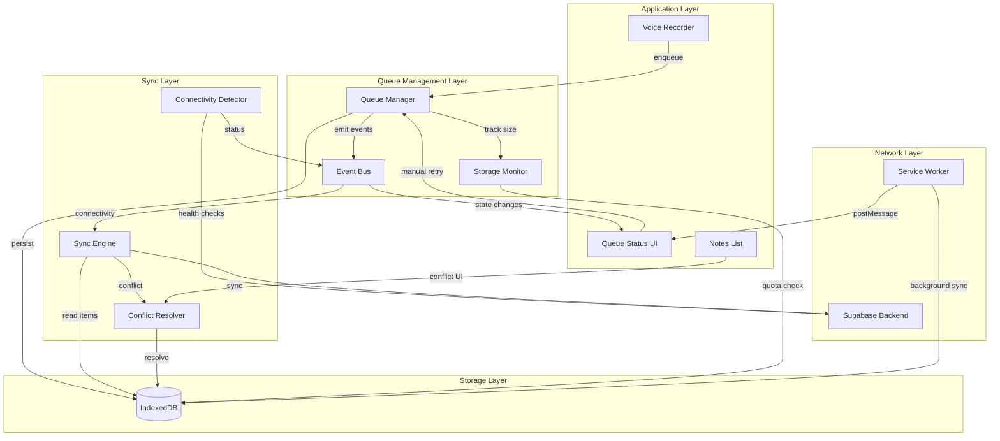

# Design Document: Offline Queue Robustness

## Overview

This design enhances the NotaVoice application's offline capabilities by replacing the current basic `useOfflineStorage` hook and placeholder service worker sync functions with a robust, modular offline queue system. The system provides reliable persistence, ordered synchronization with exponential backoff retry, conflict detection and resolution, storage quota management, real-time queue status visibility, background sync integration, and data integrity verification via checksums.

The current implementation has several gaps:
- No retry logic or exponential backoff on sync failures
- No conflict resolution when the same note is modified offline and on the server
- No queue ordering guarantees (items may sync out of order)
- No storage quota monitoring or management
- Placeholder `syncRecording()` and `getStoredRecordings()` functions in the service worker
- Transcription persistence limited to a single item in localStorage

The new architecture introduces five core modules (Queue Manager, Sync Engine, Connectivity Detector, Conflict Resolver, Storage Monitor) that work together to provide a resilient offline-first experience.

### Design Decisions

1. **IndexedDB as primary store**: Continue using IndexedDB (already in use) but with a richer schema including sequence numbers, checksums, and status tracking.
2. **Event-driven architecture**: Modules communicate via a typed event bus to maintain loose coupling.
3. **Single-item sequential sync**: Process one item at a time to preserve ordering and avoid overwhelming the Supabase backend.
4. **SHA-256 checksums**: Use the Web Crypto API (`crypto.subtle.digest`) for integrity verification — no external dependencies needed.
5. **StorageManager API for quota**: Use `navigator.storage.estimate()` for quota tracking, with graceful fallback for unsupported browsers.
6. **fast-check for property-based testing**: Use the `fast-check` library for property-based tests given the TypeScript/Vite ecosystem.

## Architecture



### Module Responsibilities

| Module | Responsibility |
|--------|---------------|
| **Queue Manager** | Enqueue/dequeue items, maintain FIFO ordering, manage item lifecycle states, expose counts |
| **Sync Engine** | Process queue items sequentially, implement retry with exponential backoff, coordinate with Connectivity Detector |
| **Connectivity Detector** | Monitor network reachability via health checks, expose tri-state connectivity status |
| **Conflict Resolver** | Detect HTTP 409 conflicts, store both versions, present resolution UI, apply chosen strategy |
| **Storage Monitor** | Track IndexedDB usage, enforce quota thresholds (80% warning, 95% block), handle QuotaExceededError recovery |
| **Event Bus** | Typed pub/sub for inter-module communication without tight coupling |

## Components and Interfaces

### Event Bus

```typescript
// src/lib/offline/eventBus.ts
type EventMap = {
  'queue:itemAdded': { item: QueueItem };
  'queue:itemRemoved': { id: string };
  'queue:stateChanged': { id: string; from: QueueItemState; to: QueueItemState };
  'queue:countsUpdated': { pending: number; inProgress: number; failed: number };
  'connectivity:changed': { state: ConnectivityState };
  'connectivity:restored': void;
  'storage:warning': { percentUsed: number };
  'storage:full': void;
  'storage:available': void;
  'conflict:detected': { conflict: ConflictRecord };
  'conflict:resolved': { id: string; strategy: ConflictStrategy };
  'sync:itemCompleted': { id: string };
  'sync:itemFailed': { id: string; reason: string };
  'integrity:corrupted': { id: string };
};

interface EventBus {
  on<K extends keyof EventMap>(event: K, handler: (payload: EventMap[K]) => void): () => void;
  emit<K extends keyof EventMap>(event: K, payload: EventMap[K]): void;
}
```

### Queue Manager

```typescript
// src/lib/offline/queueManager.ts
interface QueueManager {
  enqueue(item: EnqueueRequest): Promise<QueueItem>;
  dequeue(): Promise<QueueItem | null>;
  peek(): Promise<QueueItem | null>;
  getItem(id: string): Promise<QueueItem | null>;
  updateState(id: string, state: QueueItemState): Promise<void>;
  removeItem(id: string): Promise<void>;
  getCounts(): QueueCounts;
  getItems(options?: { limit?: number; offset?: number; state?: QueueItemState }): Promise<QueueItem[]>;
  retryItem(id: string): Promise<void>;
  deleteItem(id: string): Promise<void>;
  verifyIntegrity(): Promise<IntegrityReport>;
}
```

### Sync Engine

```typescript
// src/lib/offline/syncEngine.ts
interface SyncEngine {
  start(): void;
  stop(): void;
  processNext(): Promise<SyncResult>;
  isProcessing(): boolean;
  getRetryDelay(attemptNumber: number): number;
}

interface SyncResult {
  success: boolean;
  itemId: string;
  conflict?: boolean;
  error?: string;
}
```

### Connectivity Detector

```typescript
// src/lib/offline/connectivityDetector.ts
type ConnectivityState = 'offline' | 'degraded' | 'connected';

interface ConnectivityDetector {
  getState(): ConnectivityState;
  start(): void;
  stop(): void;
  checkNow(): Promise<boolean>;
}
```

### Conflict Resolver

```typescript
// src/lib/offline/conflictResolver.ts
type ConflictStrategy = 'keep-local' | 'keep-server' | 'keep-both';

interface ConflictResolver {
  handleConflict(localItem: QueueItem, serverVersion: ServerNote): Promise<string>;
  resolve(conflictId: string, strategy: ConflictStrategy): Promise<void>;
  getPendingConflicts(): Promise<ConflictRecord[]>;
  getConflict(id: string): Promise<ConflictRecord | null>;
  checkAutoResolve(): Promise<void>;
}

interface ConflictRecord {
  id: string;
  localVersion: QueueItem;
  serverVersion: ServerNote;
  detectedAt: number;
  resolvedAt?: number;
  strategy?: ConflictStrategy;
  autoResolved: boolean;
}
```

### Storage Monitor

```typescript
// src/lib/offline/storageMonitor.ts
interface StorageMonitor {
  getUsage(): Promise<StorageUsage>;
  canEnqueue(estimatedSize: number): Promise<boolean>;
  recalculate(): Promise<void>;
  handleQuotaExceeded(): Promise<boolean>;
}

interface StorageUsage {
  usedBytes: number;
  quotaBytes: number;
  percentUsed: number;
  itemCount: number;
}
```

### React Hooks

```typescript
// src/hooks/useOfflineQueue.ts — replaces useOfflineStorage
interface UseOfflineQueueReturn {
  enqueue: (recording: RecordingData) => Promise<string>;
  counts: QueueCounts;
  connectivity: ConnectivityState;
  items: QueueItem[];
  retryItem: (id: string) => Promise<void>;
  deleteItem: (id: string) => Promise<void>;
  conflicts: ConflictRecord[];
  resolveConflict: (id: string, strategy: ConflictStrategy) => Promise<void>;
  storageUsage: StorageUsage;
}
```

## Data Models

### IndexedDB Schema (v2)

```typescript
// Database: NotaVoiceOfflineDB, Version: 2
// Object Stores:

// Store: "queue_items"
interface QueueItem {
  id: string;                          // UUID v4
  sequenceNumber: number;              // Monotonically increasing, auto-generated
  audioBlob: Blob;                     // Audio recording (max 50 MB)
  audioBlobChecksum: string;           // SHA-256 hex digest of audioBlob
  title: string;                       // User-provided or auto-generated title
  transcription?: string;              // Transcription text if available
  transcriptionStatus: 'pending' | 'completed' | 'failed';
  createdAt: number;                   // Unix timestamp ms
  durationMs: number;                  // Recording duration in milliseconds
  sourceDeviceId: string;              // Device identifier
  state: QueueItemState;               // Current lifecycle state
  retryCount: number;                  // Number of sync attempts
  lastAttemptAt?: number;              // Timestamp of last sync attempt
  sizeBytes: number;                   // Size of audioBlob in bytes
  syncedAt?: number;                   // Timestamp when successfully synced
  error?: string;                      // Last error message
}

type QueueItemState = 'pending' | 'in-progress' | 'synced' | 'failed' | 'corrupted';

// Indexes on "queue_items":
// - "by_sequence": sequenceNumber (unique)
// - "by_state": state
// - "by_created": createdAt
// - "by_synced": syncedAt

// Store: "conflicts"
interface ConflictRecord {
  id: string;                          // UUID v4
  queueItemId: string;                 // Reference to original queue item
  localVersion: {
    title: string;
    transcription?: string;
    audioBlob: Blob;
    modifiedAt: number;
  };
  serverVersion: {
    id: string;
    title: string;
    transcription?: string;
    modifiedAt: number;
  };
  detectedAt: number;                  // When conflict was detected
  resolvedAt?: number;                 // When conflict was resolved
  strategy?: ConflictStrategy;         // Resolution strategy used
  autoResolved: boolean;               // Whether auto-resolved after 24h
}

// Store: "metadata"
interface QueueMetadata {
  key: string;                         // 'lastSequenceNumber' | 'storageUsedBytes'
  value: number;
}
```

### Queue Counts

```typescript
interface QueueCounts {
  pending: number;
  inProgress: number;
  failed: number;
  total: number;
}
```

### Enqueue Request

```typescript
interface EnqueueRequest {
  audioBlob: Blob;
  title: string;
  durationMs: number;
  transcription?: string;
  transcriptionStatus: 'pending' | 'completed' | 'failed';
}
```

### Sequence Number Generation

The Queue Manager maintains a monotonically increasing sequence counter stored in the `metadata` store. On each enqueue:
1. Read current `lastSequenceNumber` from metadata
2. Increment by 1
3. Assign to new item
4. Write both the item and updated metadata in a single transaction

This ensures ordering even across application restarts.

## Correctness Properties

*A property is a characteristic or behavior that should hold true across all valid executions of a system — essentially, a formal statement about what the system should do. Properties serve as the bridge between human-readable specifications and machine-verifiable correctness guarantees.*

### Property 1: Queue FIFO Ordering Invariant

*For any* sequence of enqueued items, when dequeued or processed by the Sync Engine, items SHALL be returned in strictly increasing sequence number order, regardless of the order in which they were inserted.

**Validates: Requirements 1.5, 3.1, 7.2**

### Property 2: Queue Item Data Completeness Round-Trip

*For any* valid enqueue request containing an audio blob, title, duration, and transcription status, persisting the item to IndexedDB and reading it back SHALL produce an item with all original fields preserved exactly, plus the system-generated fields (id, sequenceNumber, checksum, state, retryCount, sizeBytes, createdAt).

**Validates: Requirements 1.2**

### Property 3: Write Retry Exhaustion

*For any* queue item where IndexedDB write fails, the Queue Manager SHALL retry exactly 3 times before giving up, and the item SHALL remain in memory throughout all retry attempts.

**Validates: Requirements 1.3**

### Property 4: Connectivity State Machine Transitions

*For any* sequence of browser online/offline events and health check results, the Connectivity Detector state SHALL always be one of {offline, degraded, connected}, and SHALL transition to 'degraded' only after 2 consecutive health check failures while browser reports online, and SHALL transition to 'connected' only after 1 successful health check from degraded state, and SHALL immediately transition to 'offline' on any browser offline event.

**Validates: Requirements 2.1, 2.3, 2.4, 2.5, 2.6**

### Property 5: Exponential Backoff Calculation

*For any* retry attempt number N (1 ≤ N ≤ 5), the computed backoff delay SHALL equal 2^(N-1) seconds (i.e., 1s, 2s, 4s, 8s, 16s), and no retry SHALL be attempted beyond attempt 5.

**Validates: Requirements 3.2, 7.5**

### Property 6: Sequential Sync Processing

*For any* queue containing multiple pending items, at most one item SHALL have state 'in-progress' at any point in time during synchronization.

**Validates: Requirements 3.3, 3.6**

### Property 7: Successful Sync Removes Item

*For any* queue item that receives a successful server acknowledgment, the item SHALL be removed from the queue and the pending count SHALL decrease by exactly one.

**Validates: Requirements 3.5**

### Property 8: Conflict Resolution Preserves Data

*For any* conflict between a local version and a server version, applying any of the three resolution strategies (keep-local, keep-server, keep-both) SHALL never result in data loss — specifically, "keep-local" retains the local version, "keep-server" retains the server version, and "keep-both" retains both versions as separate items.

**Validates: Requirements 4.1, 4.3**

### Property 9: Conflict Bypass for Non-Conflicting Items

*For any* queue containing both conflicted and non-conflicted items, the Sync Engine SHALL continue processing all non-conflicted items regardless of unresolved conflicts.

**Validates: Requirements 4.5**

### Property 10: Conflict Suffix Naming

*For any* note title and resolution timestamp, when the "keep-both" strategy is applied, the duplicate note title SHALL equal the original title appended with a conflict suffix containing the resolution timestamp, and the suffix SHALL make the duplicate distinguishable from the original.

**Validates: Requirements 4.8**

### Property 11: Storage Threshold Enforcement

*For any* storage usage level, enqueue requests SHALL be accepted when usage is below 95% of quota and rejected when usage is at or above 95% of quota, and a warning notification SHALL be active when and only when usage is between 80% and 95% of quota.

**Validates: Requirements 5.2, 5.3, 5.4**

### Property 12: Storage Tracking Accuracy

*For any* sequence of enqueue and remove operations, the Storage Monitor's reported total size SHALL equal the sum of `sizeBytes` of all items currently stored in IndexedDB.

**Validates: Requirements 5.1**

### Property 13: Queue State Counts Accuracy

*For any* queue state, the exposed counts (pending, inProgress, failed) SHALL exactly equal the number of items in each respective state in IndexedDB.

**Validates: Requirements 6.1**

### Property 14: Retry Count Monotonic Increment

*For any* queue item, each failed synchronization attempt (whether automatic or manual) SHALL increment the retry count by exactly one, and the retry count SHALL never decrease.

**Validates: Requirements 6.7, 3.7**

### Property 15: Checksum Integrity Round-Trip

*For any* audio blob, computing the SHA-256 checksum at persist time and recomputing it at sync time SHALL produce identical values if and only if the blob has not been modified.

**Validates: Requirements 8.1, 8.2**

## Error Handling

### Error Categories and Responses

| Error | Module | Response |
|-------|--------|----------|
| IndexedDB write failure | Queue Manager | Retry 3x with 500ms delay, then hold in memory + notify user |
| QuotaExceededError | Storage Monitor | Remove up to 10 oldest synced items, retry once; if no synced items, reject + notify |
| Network timeout (>30s) | Sync Engine | Mark attempt failed, apply exponential backoff, retry up to 5x |
| HTTP 5xx from server | Sync Engine | Same as network timeout — exponential backoff retry |
| HTTP 409 Conflict | Conflict Resolver | Store both versions, notify user, await resolution (auto-resolve after 24h) |
| Checksum mismatch | Sync Engine | Mark item as 'corrupted', halt sync for that item, notify user with recovery options |
| Transaction abort | Queue Manager | No partial data persisted (atomic), notify user of save failure |
| Background Sync API unsupported | Queue Manager | Fall back to foreground sync on app focus |
| Health check timeout (>3s) | Connectivity Detector | Count as failed check, after 2 consecutive → mark degraded |
| Connectivity lost mid-sync | Sync Engine | Revert item to 'pending', increment retry count, wait for connectivity restored |

### User Notifications

Notifications use the existing `sonner` toast library already in the project:

- **Persistent (non-dismissible)**: Storage full (95%), corrupted item detected, unsynced items indicator
- **Persistent (dismissible)**: Storage warning (80%), sync failure after max retries
- **Transient**: Successful sync completion, conflict auto-resolved

### Recovery Strategies

1. **Corrupted items**: User can retry sync (recomputes checksum), re-record, or delete
2. **Failed items**: User can manually retry (resets to pending with incremented count) or delete
3. **Storage full**: User must wait for sync to complete, or manually delete items
4. **Unresolved conflicts**: Auto-resolve to "keep both" after 24 hours

## Testing Strategy

### Property-Based Testing

This feature is well-suited for property-based testing because:
- The queue operations are pure data transformations with clear input/output behavior
- Universal properties (ordering, integrity, state machine transitions) hold across all valid inputs
- The input space is large (varying blob sizes, sequences of operations, timing of events)

**Library**: `fast-check` (TypeScript PBT library, well-maintained, integrates with Vitest)

**Configuration**: Minimum 100 iterations per property test.

**Tag format**: `Feature: offline-queue-robustness, Property {number}: {property_text}`

Each correctness property (1–15) will be implemented as a single property-based test.

### Unit Tests (Example-Based)

- Conflict notification content includes title, timestamps, and options (Req 4.2)
- Queue status UI displays persistent indicator when items exist (Req 6.3)
- Manual retry action available for failed items (Req 6.5)
- Deletion confirmation prompt before removal (Req 6.6)
- Empty state message when queue is empty (Req 6.8)
- Background Sync API fallback to focus-based sync (Req 7.3)
- Atomic transaction prevents partial writes (Req 8.5)
- Corrupted item presents recovery options (Req 8.6)

### Integration Tests

- Service worker background sync processes items and posts messages to clients (Req 7.2, 7.4)
- Periodic health checks fire at 30-second intervals (Req 2.2)
- State change events emit within 100ms of transition (Req 6.2)
- Startup integrity verification completes within 5 seconds (Req 8.4)

### Edge Case Tests (Covered by Property Generators)

- All IndexedDB write retries exhausted → notification + manual retry (Req 1.4)
- QuotaExceededError with no synced items to remove (Req 5.6)
- Connectivity lost mid-sync → revert to pending (Req 3.7)
- Conflict resolution sync failure → revert to unresolved (Req 4.7)
- Max retry count exceeded → mark failed, proceed to next (Req 3.4)
- QuotaExceededError during write → evict oldest synced items (Req 5.5)
- Background sync item fails all retries → mark failed, re-register (Req 7.6)

### Test Infrastructure

- **IndexedDB mocking**: Use `fake-indexeddb` for unit/property tests
- **Network mocking**: Use `msw` (Mock Service Worker) for HTTP request interception
- **Timer mocking**: Use Vitest's `vi.useFakeTimers()` for backoff and periodic check tests
- **Blob generation**: Use `fast-check` arbitraries to generate random Blob instances of varying sizes
- **Service Worker testing**: Use `@pwa/testing` or manual mocks for SW lifecycle events
