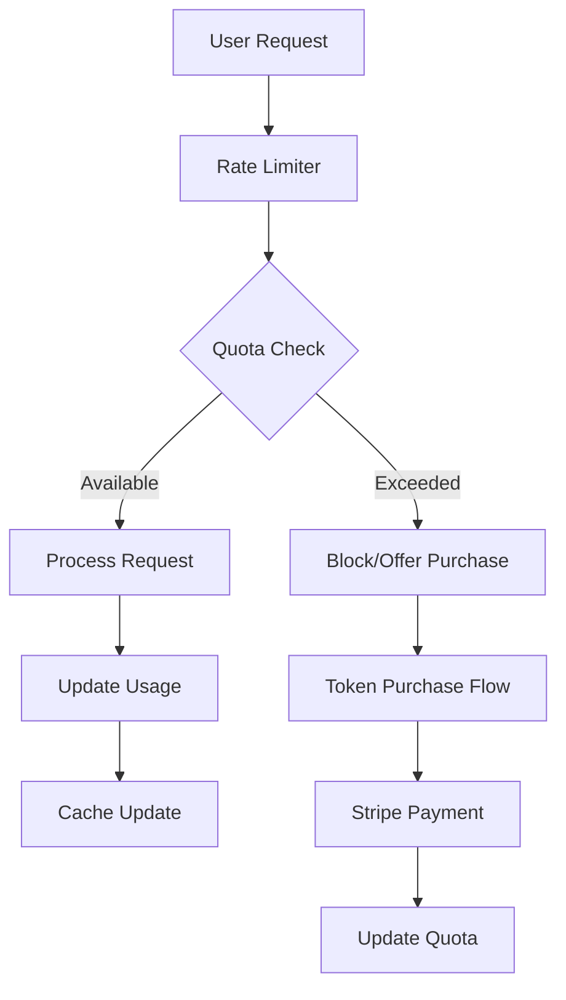

# Design Document

## Overview

The tenant resource quota system is designed as a lightweight, high-performance solution that integrates seamlessly with the existing Supabase architecture. The design prioritizes minimal code footprint, fast response times, and reduced complexity while providing comprehensive quota management capabilities.

## Architecture

### Core Components

1. **Quota Engine** - Lightweight service for quota validation and tracking
2. **Usage Tracker** - Real-time usage monitoring with efficient caching
3. **Token Store** - Purchase and allocation management
4. **Rate Limiter** - High-performance request throttling
5. **Admin Dashboard** - Configuration interface for quota management

### Data Flow



## Components and Interfaces

### 1. Database Schema Extensions

**Minimal additions to existing schema:**

```sql
-- Subscription tiers configuration
CREATE TABLE subscription_tiers (
  id UUID PRIMARY KEY DEFAULT gen_random_uuid(),
  name TEXT NOT NULL, -- 'free', 'paid'
  monthly_tokens INTEGER NOT NULL DEFAULT 10000,
  transcription_queries INTEGER NOT NULL DEFAULT 100,
  storage_gb INTEGER NOT NULL DEFAULT 1,
  price_per_1k_tokens DECIMAL(10,2) DEFAULT 0.05,
  created_at TIMESTAMPTZ DEFAULT NOW(),
  updated_at TIMESTAMPTZ DEFAULT NOW()
);

-- Organization quotas (extends existing organizations table)
ALTER TABLE organizations ADD COLUMN IF NOT EXISTS current_tokens INTEGER DEFAULT 0;
ALTER TABLE organizations ADD COLUMN IF NOT EXISTS current_transcriptions INTEGER DEFAULT 0;
ALTER TABLE organizations ADD COLUMN IF NOT EXISTS current_storage_bytes BIGINT DEFAULT 0;
ALTER TABLE organizations ADD COLUMN IF NOT EXISTS quota_reset_date TIMESTAMPTZ DEFAULT DATE_TRUNC('month', NOW() + INTERVAL '1 month');

-- Usage tracking for analytics
CREATE TABLE usage_events (
  id UUID PRIMARY KEY DEFAULT gen_random_uuid(),
  organization_id UUID REFERENCES organizations(id),
  event_type TEXT NOT NULL, -- 'transcription', 'tokens', 'storage'
  amount INTEGER NOT NULL,
  created_at TIMESTAMPTZ DEFAULT NOW()
);

-- Token purchases
CREATE TABLE token_purchases (
  id UUID PRIMARY KEY DEFAULT gen_random_uuid(),
  organization_id UUID REFERENCES organizations(id),
  tokens_purchased INTEGER NOT NULL DEFAULT 1000,
  amount_paid DECIMAL(10,2) NOT NULL,
  stripe_payment_id TEXT,
  created_at TIMESTAMPTZ DEFAULT NOW()
);
```

### 2. Quota Engine Implementation

**Lightweight TypeScript service:**

```typescript
// src/lib/quota-engine.ts
interface QuotaLimits {
  monthlyTokens: number;
  transcriptionQueries: number;
  storageBytes: number;
}

interface UsageData {
  currentTokens: number;
  currentTranscriptions: number;
  currentStorageBytes: number;
  resetDate: Date;
}

class QuotaEngine {
  private cache = new Map<string, { data: UsageData; expires: number }>();
  private readonly CACHE_TTL = 5 * 60 * 1000; // 5 minutes

  async checkQuota(
    organizationId: string, 
    resourceType: 'tokens' | 'transcription' | 'storage',
    amount: number = 1
  ): Promise<{ allowed: boolean; remaining: number; resetDate: Date }> {
    const usage = await this.getUsageData(organizationId);
    const limits = await this.getQuotaLimits(organizationId);
    
    // Fast in-memory calculation
    switch (resourceType) {
      case 'tokens':
        const tokensRemaining = limits.monthlyTokens - usage.currentTokens;
        return {
          allowed: tokensRemaining >= amount,
          remaining: Math.max(0, tokensRemaining - amount),
          resetDate: usage.resetDate
        };
      case 'transcription':
        const transcriptionsRemaining = limits.transcriptionQueries - usage.currentTranscriptions;
        return {
          allowed: transcriptionsRemaining >= amount,
          remaining: Math.max(0, transcriptionsRemaining - amount),
          resetDate: usage.resetDate
        };
      case 'storage':
        const storageRemaining = limits.storageBytes - usage.currentStorageBytes;
        return {
          allowed: storageRemaining >= amount,
          remaining: Math.max(0, storageRemaining - amount),
          resetDate: usage.resetDate
        };
    }
  }

  async consumeQuota(
    organizationId: string,
    resourceType: 'tokens' | 'transcription' | 'storage',
    amount: number
  ): Promise<void> {
    // Optimistic update with database sync
    await this.updateUsage(organizationId, resourceType, amount);
    this.invalidateCache(organizationId);
  }

  private async getUsageData(organizationId: string): Promise<UsageData> {
    const cached = this.cache.get(organizationId);
    if (cached && cached.expires > Date.now()) {
      return cached.data;
    }

    // Single query to get current usage
    const { data } = await supabase
      .from('organizations')
      .select('current_tokens, current_transcriptions, current_storage_bytes, quota_reset_date')
      .eq('id', organizationId)
      .single();

    const usage: UsageData = {
      currentTokens: data.current_tokens || 0,
      currentTranscriptions: data.current_transcriptions || 0,
      currentStorageBytes: data.current_storage_bytes || 0,
      resetDate: new Date(data.quota_reset_date)
    };

    this.cache.set(organizationId, {
      data: usage,
      expires: Date.now() + this.CACHE_TTL
    });

    return usage;
  }
}

export const quotaEngine = new QuotaEngine();
```

### 3. React Hook for Quota Management

**Minimal React integration:**

```typescript
// src/hooks/useQuota.ts
export const useQuota = () => {
  const { currentOrganization } = useOrganization();
  
  const { data: quotaStatus, refetch } = useQuery({
    queryKey: ['quota', currentOrganization?.id],
    queryFn: async () => {
      if (!currentOrganization) return null;
      
      const response = await fetch(`/api/quota/${currentOrganization.id}`);
      return response.json();
    },
    enabled: !!currentOrganization,
    staleTime: 2 * 60 * 1000, // 2 minutes
    refetchInterval: 5 * 60 * 1000, // 5 minutes
  });

  const checkQuota = useCallback(async (
    resourceType: 'tokens' | 'transcription' | 'storage',
    amount: number = 1
  ) => {
    if (!currentOrganization) return { allowed: false, remaining: 0 };
    
    const response = await fetch('/api/quota/check', {
      method: 'POST',
      headers: { 'Content-Type': 'application/json' },
      body: JSON.stringify({
        organizationId: currentOrganization.id,
        resourceType,
        amount
      })
    });
    
    return response.json();
  }, [currentOrganization]);

  const purchaseTokens = useMutation({
    mutationFn: async () => {
      const response = await fetch('/api/tokens/purchase', {
        method: 'POST',
        headers: { 'Content-Type': 'application/json' },
        body: JSON.stringify({
          organizationId: currentOrganization?.id,
          tokens: 1000
        })
      });
      return response.json();
    },
    onSuccess: () => {
      refetch();
      toast.success('Tokens purchased successfully!');
    }
  });

  return {
    quotaStatus,
    checkQuota,
    purchaseTokens,
    refetch
  };
};
```

### 4. Lightweight UI Components

**Minimal UI additions:**

```typescript
// src/components/quota/QuotaDisplay.tsx
export const QuotaDisplay = () => {
  const { quotaStatus } = useQuota();
  
  if (!quotaStatus) return null;

  return (
    <div className="flex gap-4 text-sm">
      <QuotaItem 
        label="Tokens" 
        used={quotaStatus.tokens.used} 
        total={quotaStatus.tokens.total}
        type="tokens"
      />
      <QuotaItem 
        label="Transcriptions" 
        used={quotaStatus.transcriptions.used} 
        total={quotaStatus.transcriptions.total}
        type="transcription"
      />
      <QuotaItem 
        label="Storage" 
        used={quotaStatus.storage.used} 
        total={quotaStatus.storage.total}
        type="storage"
        unit="GB"
      />
    </div>
  );
};

const QuotaItem = ({ label, used, total, type, unit = "" }) => {
  const percentage = (used / total) * 100;
  const isNearLimit = percentage > 90;
  
  return (
    <div className="flex items-center gap-2">
      <span className="text-muted-foreground">{label}:</span>
      <span className={cn(
        "font-medium",
        isNearLimit && "text-destructive"
      )}>
        {used.toLocaleString()}/{total.toLocaleString()} {unit}
      </span>
      {isNearLimit && type === 'tokens' && <TokenPurchaseButton />}
    </div>
  );
};
```

## Data Models

### Quota Configuration Model
```typescript
interface QuotaConfig {
  tierId: string;
  tierName: 'free' | 'paid';
  monthlyTokens: number;
  transcriptionQueries: number;
  storageGB: number;
  pricePerThousandTokens: number;
}
```

### Usage Tracking Model
```typescript
interface UsageSnapshot {
  organizationId: string;
  tokens: { used: number; total: number; resetDate: Date };
  transcriptions: { used: number; total: number; resetDate: Date };
  storage: { used: number; total: number; unit: 'bytes' | 'GB' };
}
```

## Error Handling

### Graceful Degradation Strategy
1. **Cache Failures**: Fall back to database queries with increased latency
2. **Database Unavailable**: Allow limited functionality with local storage tracking
3. **Payment Failures**: Queue purchase requests for retry
4. **Quota Exceeded**: Provide clear upgrade paths and temporary overages

### Error Response Format
```typescript
interface QuotaError {
  code: 'QUOTA_EXCEEDED' | 'PAYMENT_FAILED' | 'INVALID_TIER';
  message: string;
  suggestedAction: 'PURCHASE_TOKENS' | 'UPGRADE_PLAN' | 'CONTACT_SUPPORT';
  metadata?: {
    currentUsage?: number;
    quotaLimit?: number;
    purchaseUrl?: string;
  };
}
```

## Testing Strategy

### Unit Tests
- Quota calculation accuracy
- Cache invalidation logic
- Rate limiting algorithms
- Payment processing flows

### Integration Tests
- End-to-end quota enforcement
- Stripe payment integration
- Database consistency checks
- Performance under load

### Performance Tests
- Quota check latency (target: <50ms)
- Cache hit rates (target: >95%)
- Concurrent request handling
- Memory usage optimization

## Security Considerations

### Data Protection
- Encrypt sensitive quota data in transit
- Implement proper access controls for admin functions
- Audit all quota modifications
- Secure payment processing with Stripe

### Rate Limiting Security
- Prevent quota bypass attempts
- Implement request signing for quota APIs
- Monitor for unusual usage patterns
- Implement circuit breakers for system protection

## Performance Optimizations

### Caching Strategy
- In-memory quota cache with 5-minute TTL
- Redis fallback for distributed deployments
- Lazy loading of quota configurations
- Batch updates for usage tracking

### Database Optimizations
- Indexed queries on organization_id and resource_type
- Materialized views for usage analytics
- Partitioned tables for historical data
- Connection pooling for high concurrency

### Frontend Optimizations
- Lazy loading of quota components
- Debounced usage updates
- Optimistic UI updates
- Minimal re-renders with React.memo